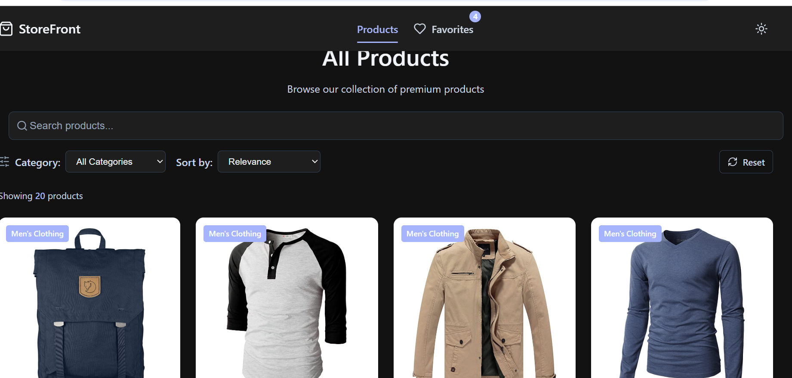
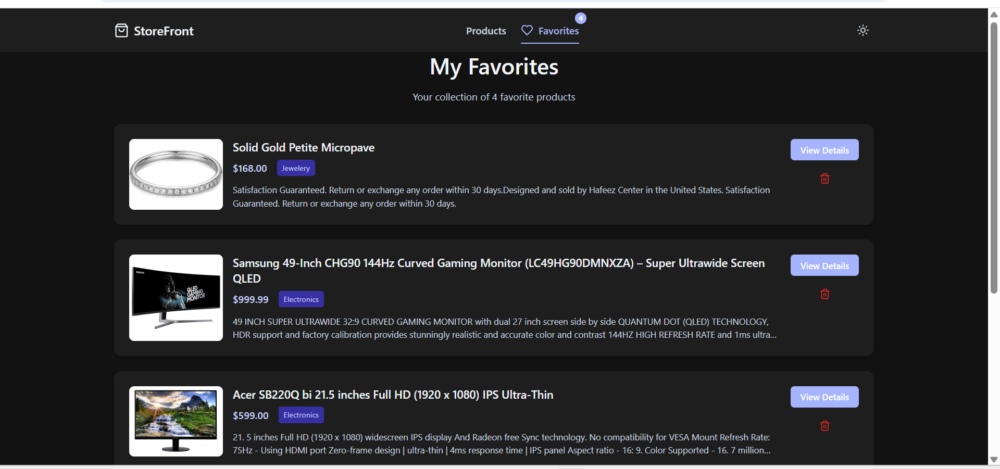
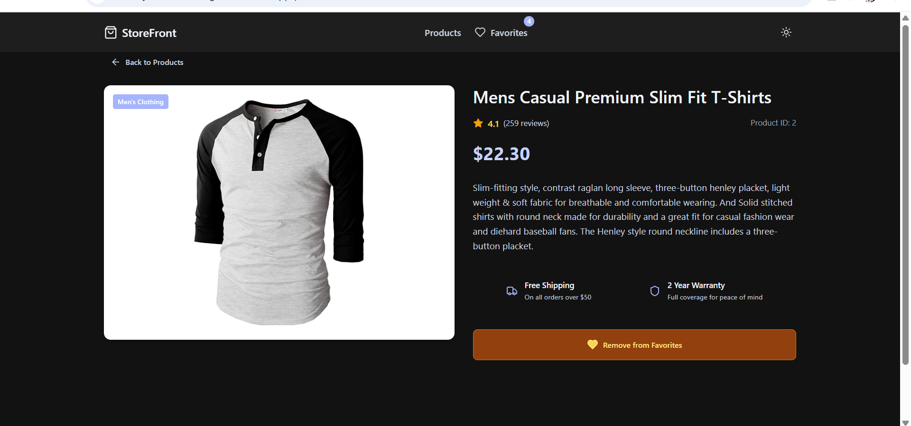

# StoreFront - Product Dashboard

A modern product dashboard built with React, Redux Toolkit, and custom CSS styling. This application allows users to browse products from the Fake Store API, filter and sort them, view detailed product information, and maintain a list of favorite products.

---

## 🚀 Features

- 🛒 Product listing with responsive grid layout  
- 🔍 Product search with debounced input  
- 📂 Category filtering and price/rating sorting  
- 📄 Detailed product pages  
- ❤️ Favorites management with localStorage persistence  
- 🌗 Light/dark theme toggle  
- ✅ Comprehensive test coverage

---

## 🛠 Tech Stack

- ⚛️ React 18 with TypeScript  
- 📦 Redux Toolkit for state management  
- 🔁 React Router for navigation  
- 🎨 Custom CSS for styling (no UI libraries)  
- 🧪 Vitest for testing  
- 🧩 Lucide React for icons

---

## 📸 Screenshots

### 🖼 Product Listing


### 📘 Product Detail Page


### ❤️ Favorites Page


---

## 🧑‍💻 Getting Started

### 📋 Prerequisites

- Node.js 18+  
- npm (Node Package Manager)

### 📦 Installation

1. **Clone the repository**

```bash
git clone https://github.com/shashikantRupin/neuradynamics-ai-assignment
cd frontend
